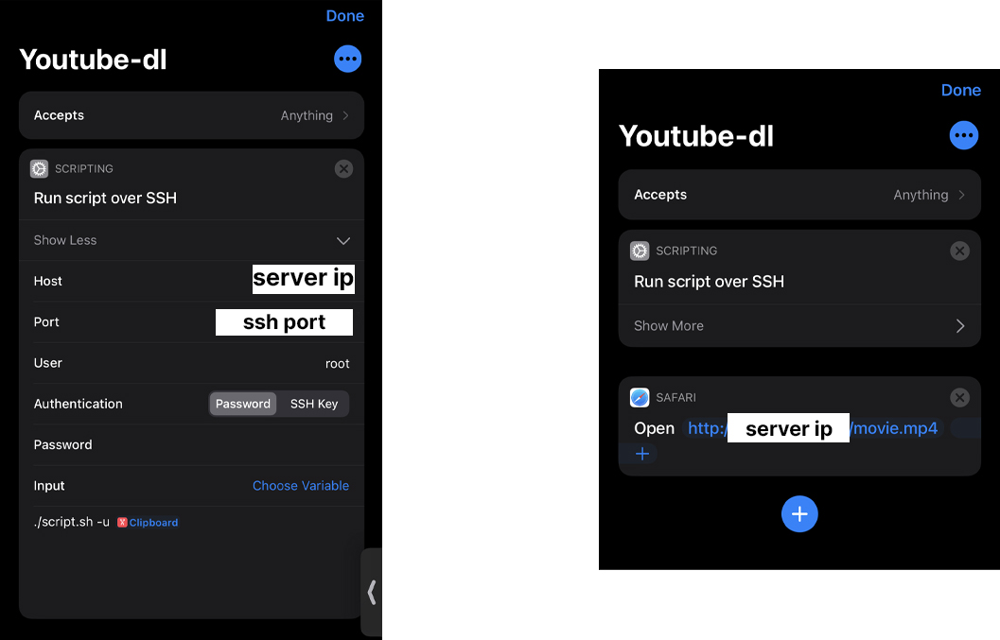

# ios-youtube-dl
I don't like paying $15 a month to listen to youtube videos with my phone locked 

## Server-Side installation 

```bash 
sudo apt install apache2 youtube-dl 
git clone https://github.com/NotJoeMartinez/bootleg-youtube-premium
cd bootleg-youtube-premium 
pip3 install -r requirements.txt
sudo mkdir /var/www/html/videos
```

## iOS installation 

You'll need to use the [shortcuts](https://apps.apple.com/us/app/shortcuts/id915249334) app for this. It has a feature that allows you
to run scripts over ssh.      

